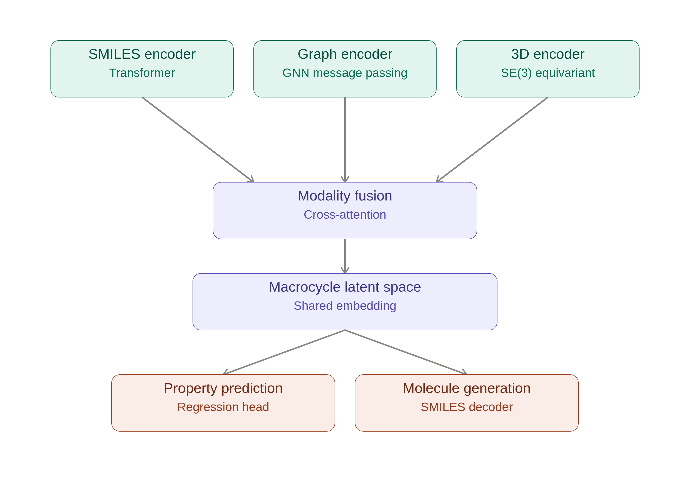

# Macrocycle Multi-Modal Model





git clone (git@github.com:SureshGXAI/Macrocycle_Multi_Modal.git)
cd Macrocycle_Multi_Modal

pip install -r requirements.txt


All the trainings, evaluation, prediction, and generation steps can be run using:

bash run.sh 


## Project layout

```
config.py              # DataConfig / ModelConfig / TrainConfig dataclasses
data/
  tokenizer.py          # SMILES regex tokenizer + vocab builder
  featurize.py           # RDKit atom/bond featurization, 3D coord extraction
  dataset.py               # SDF loading -> MacrocycleRecord -> MacrocycleDataset
  collate.py                # batches variable-size graphs / coords / SMILES
models/
  smiles_encoder.py      # Transformer encoder branch
  graph_encoder.py         # MPNN/GNN branch (dependency-free, pure PyTorch)
  encoder_3d.py              # E(n)-equivariant (EGNN) 3D branch
  fusion.py                    # cross-modal attention fusion -> latent
  property_head.py               # regression head
  generator.py                     # autoregressive SMILES decoder (generation)
  model.py                           # MacrocycleModel wiring it all together
losses.py               # property MSE + generation CE + InfoNCE contrastive
utils.py                 # seeding, checkpoint save/load
train.py                   # main training entrypoint
predict.py                    # property inference on new SMILES/SDF
generate.py                      # sampling / reconstruction / interpolation
```

## Data format

Point `--sdf_path` at your 50K-molecule SDF. Each record should be a valid,
sanitizable RDKit molecule. If a record already has a 3D conformer (typical
for macrocycle SDFs coming from a conformer search / docking pipeline), those
coordinates are used directly; otherwise one conformer is embedded with
ETKDGv3 + MMFF94 optimization.

Target properties are read from SDF property fields named in
`DataConfig.property_fields` (default: `MolWt, LogP, TPSA, RingCount,
MacrocycleSize`). Any field missing on a given record falls back to an RDKit
descriptor computation, so partially-labeled SDFs work fine. Swap in your own
assay/property field names (e.g. `pIC50`, `Permeability`, `Solubility`) to
train on real experimental macrocycle data.

## Train

Useful flags: `--limit 500` (debug on a subset), `--device cpu`, `--resume
checkpoints/macrocycle_epoch49.pt`.

The training loop jointly optimizes:
1. **Property regression** — masked MSE (robust to NaN/missing targets)
2. **Generation** — teacher-forced cross-entropy on next-token SMILES prediction
3. **Cross-modal contrastive (InfoNCE)** — aligns the SMILES/graph/3D pooled
   embeddings for the *same* molecule while separating different molecules in
   the batch. This is what makes the fused space an actual *shared* macrocycle
   latent space instead of three independent, unrelated embeddings.

Loss weights are set in `TrainConfig` (`w_property`, `w_generation`,
`w_contrastive`).

## Software stack covered 
rdkit, PyTorch, scikit-learn, Numpy, Matplotlib
